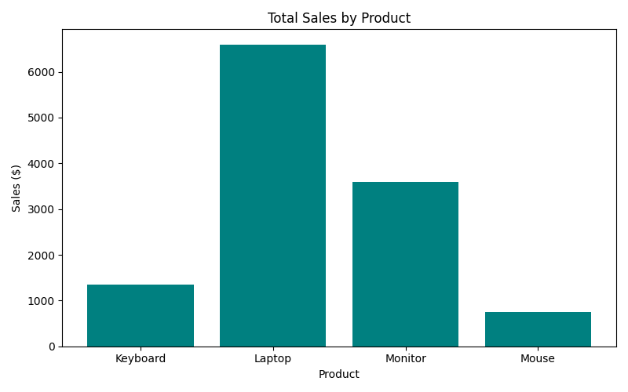
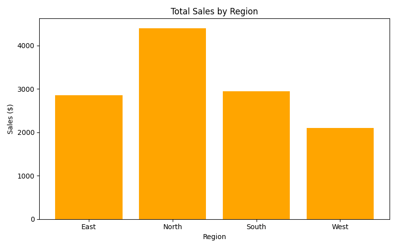
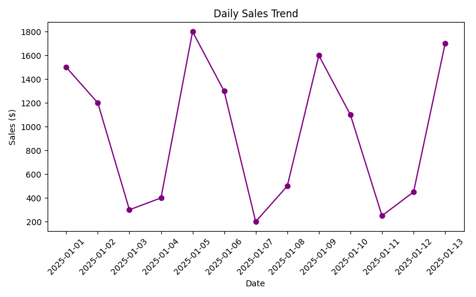

# 📊 Maddy Cloud Analytics Project

This project demonstrates a simple, cloud-friendly **data analytics workflow using Python**.  
It reads sample sales data, analyzes it with `pandas`, and visualizes results with `matplotlib`.

---

## 🧰 Tech Stack
- Python 3.12
- pandas
- matplotlib
- Git & GitHub
- (Optional) AWS S3
- (New) Terraform for Infrastructure as Code (IaC)

---

## 📂 Project Structure
Maddy-Cloud-Analytics/
├── data/
│ └── sample_sales.csv
├── output/
│ ├── sales_by_product.png
│ ├── sales_by_region.png
│ └── sales_trend.png
├── visualize_sales.py
├── requirements.txt
├── infra/
│   └── terraform/
│       ├── main.tf
│       ├── versions.tf
│       └── outputs.tf
└── README.md

## 📈 Example Charts

### Total Sales by Product

### Total Sales by Region

### Daily Sales Trend

☁️ Deployment

This project can be hosted as a static dashboard on AWS S3 to showcase analytics visualizations.
Automation is handled using GitHub Actions, which runs the Python visualization script automatically on each push to the repository.

⚙️ Infrastructure as Code (Terraform)

This project also includes a Terraform module under /infra/terraform that provisions a custom AWS VPC to demonstrate real-world DevOps and IaC skills.

Highlights:

Creates a secure, tagged AWS VPC (maddy-vpc) using Terraform.

Demonstrates a full IaC workflow: init → plan → apply → destroy.

Uses provider pinning, outputs, and .gitignore for safe version control.

Easily extensible — can add subnets, gateways, or EC2 instances later.

Commands:

terraform init       # Initialize Terraform
terraform plan       # Preview resources
terraform apply      # Create VPC
terraform destroy    # Clean up

Key Concepts:

Infrastructure as Code (IaC)

Idempotence (repeatable builds)

Provider and version control

Secure handling of Terraform state

🚀 Future Enhancements

Integrate AWS Lambda for automatic data refresh.

Upload generated charts to S3 via GitHub Actions.

Add a front-end dashboard (HTML + Bootstrap) for interactivity.

Extend the Terraform setup with subnets, route tables, and EC2 instances.

Include a CI/CD validation workflow (terraform fmt + validate) to ensure consistent IaC quality.

